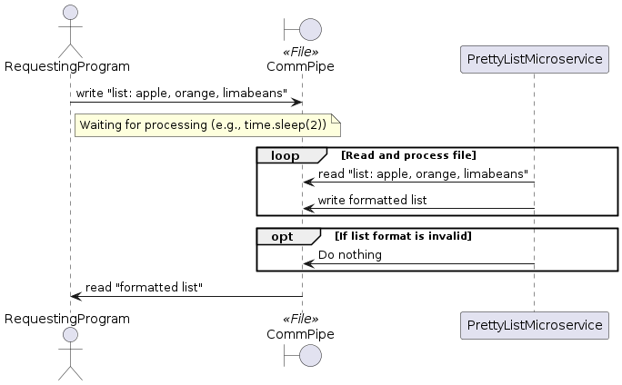

# prettylistsmicroservice

## Overview

This is a pretty list micro service that takes in comma seperated lists and turns them into a variety of prettier lists(relativly) 


### Prerequisites

- Python 3.x

### Installation

   ```sh
   git clone https://github.com/mrnotcrazy/prettylistsmicroservice.git
   cd prettylistsmicroservice
   python3 pretty_list_service.py
```
### There are four possible styles a default and then three more
~~~text
Default:
1:Apple
2:Orange
3:Limabeans

style 0:
-------
|one   |
-------
|two   |
-------
|three |
-------

Style 1:
 <ul><li>one</li><li>two</li><li>three</li></ul>

Style 2:
--> one
--> two
--> three
~~~
### Making requests:

- To request a pretty list first you will need to know the file name for the interface, by default this will be list.txt. If you want something else you will have to edit the script.
- start the string to write with "list:" for the default style and add the correct number for a specific style. For example "list:1,2,3" is default but "list0: 1,2,3" is style 0 and "list2:1,2,3" is style 2
- append your list of items as comma seperated values and write to file.

Some example code is bellow which is taken from the test.py file: 
```
  def write_to_file(content):
    with open("list.txt", 'w') as file:
        file.write(content)

    # Test with "list:"
    write_to_file("list: apple, orange, limabeans")
    time.sleep(2)  # Wait for the microservice to process
    with open("list.txt", 'r') as file:
        print("list: output:\n", file.read())
        
    # Test with "list0:"
    write_to_file("list0: one, two, three")
    time.sleep(2)
    with open("list.txt", 'r') as file:
        print("list0: output:\n", file.read())

    # Test with "list1:"
    write_to_file("list1: one, two, three")
    time.sleep(2)
    with open("list.txt", 'r') as file:
        print("list1: output:\n", file.read())
        
    # Test with "list2:"
    write_to_file("list2: one, two, three")
    time.sleep(2)
    with open("list.txt", 'r') as file:
        print("list2: output:\n", file.read())
```


### Receiving Data:

As listed in the previous coding example receiving data is simple as sleeping for a moment and then reading from the file. 
```
  def write_to_file(content):
    with open("list.txt", 'w') as file:
        file.write(content)

    # Test with "list:"
    write_to_file("list: apple, orange, limabeans")
    time.sleep(2)  # Wait for the microservice to process
    with open("list.txt", 'r') as file:
        print("list: output:\n", file.read())
```

### UML Sequence Diagram(generated using https://www.planttext.com/)


